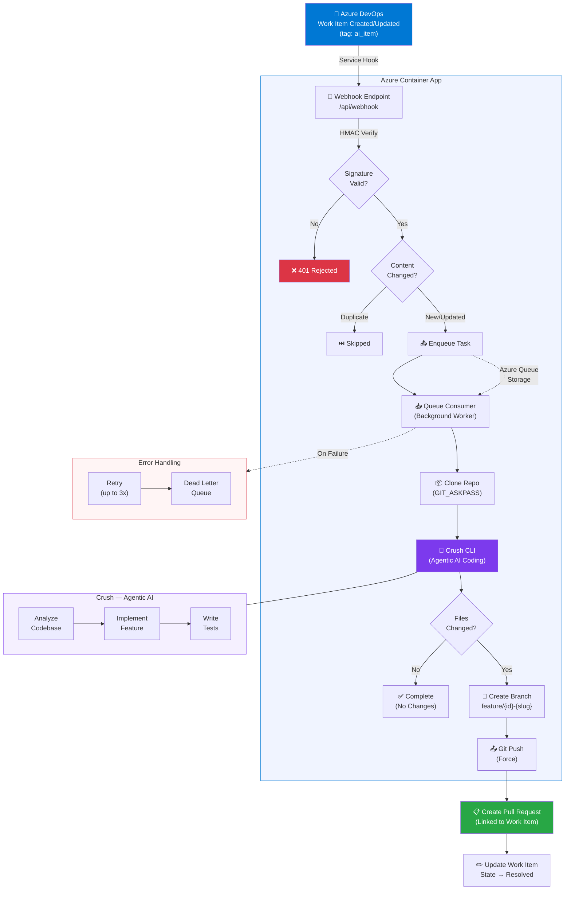

# Azure DevOps AI Coder

Automatically implement features from Azure DevOps Work Items using an agentic AI coding assistant. When a work item is tagged with `ai_item`, this service clones the target repo, runs [Crush](https://github.com/charmbracelet/crush) (an agentic AI CLI) to autonomously implement the feature, and creates a Pull Request for human review.

## How It Works



## Architecture

```
Azure DevOps Work Item (tag: ai_item)
        │
        ▼
Webhook Endpoint ──► HMAC Verification ──► Content-Aware Dedup
        │
        ▼
Azure Queue Storage (with DLQ & retry)
        │
        ▼
Background Worker ──► Git Clone ──► Crush CLI (Azure OpenAI)
        │
        ▼
Git Push ──► Pull Request ──► Work Item Updated
```

**Key components:**

- **Crush CLI** — Agentic AI coding tool (successor to OpenCode) that autonomously reads codebases, edits files, runs commands, and writes tests
- **Azure OpenAI** — LLM backend (e.g. `gpt-4o-mini`) powering the AI agent
- **Content-aware dedup** — Hashes `workItemId + title + description` so description updates trigger re-processing

## Prerequisites

- Azure subscription
- Azure DevOps organization with a PAT (scopes: **Code Read & Write**, **Work Items Read & Write**)
- Azure OpenAI resource with a deployed model
- Azure Container Registry
- Terraform >= 1.5.0
- Docker (with `buildx` for cross-platform builds)

## Quick Start

### 1. Clone & Configure

```bash
git clone https://github.com/your-username/azure-devops-ai-coder.git
cd azure-devops-ai-coder

# Copy and fill in your values
cp app/.env.example app/.env
```

### 2. Build & Push Container Image

```bash
cd app

# Login to your ACR
az acr login --name <your-acr>

# Build for linux/amd64 (required for Azure Container Apps)
docker buildx build --platform linux/amd64 \
  -t <your-acr>.azurecr.io/ai-coder:latest --push .
```

> **Note**: On Apple Silicon Macs, you must use `--platform linux/amd64` to avoid architecture mismatch errors.

### 3. Deploy Infrastructure

```bash
cd terraform
terraform init

terraform apply \
  -var="azure_openai_endpoint=https://your-resource.openai.azure.com/" \
  -var="azure_openai_key=your-key" \
  -var="azure_devops_org=your-org" \
  -var="azure_devops_pat=your-pat" \
  -var="container_image=your-acr.azurecr.io/ai-coder:latest" \
  -var="acr_server=your-acr.azurecr.io" \
  -var="acr_username=your-acr-user" \
  -var="acr_password=your-acr-password" \
  -var='project_repo_map={"MyProject":"https://dev.azure.com/org/MyProject/_git/MyRepo"}'
```

### 4. Configure Azure DevOps Service Hook

1. Go to **Project Settings → Service Hooks → Create Subscription**
2. Select **Web Hooks**
3. Trigger: **Work item updated**
4. Filter: Tags contain `ai_item`
5. URL: Use the `webhook_url` from Terraform output
6. Secret: _(optional)_ Set same value as `webhook_secret`

### 5. Create Your First AI Task

1. Create a Work Item in Azure DevOps
2. Add the `ai_item` tag
3. Write a clear description of the feature you want implemented
4. Save — the AI Coder will pick it up, implement it, and create a PR

## Configuration

### Environment Variables

| Variable | Description | Required | Default |
|----------|-------------|----------|---------|
| `AZURE_OPENAI_ENDPOINT` | Azure OpenAI endpoint URL | Yes | — |
| `AZURE_OPENAI_KEY` | Azure OpenAI API key | Yes | — |
| `AZURE_OPENAI_DEPLOYMENT` | Model deployment name | No | `gpt-4o` |
| `AZURE_DEVOPS_PAT` | Azure DevOps Personal Access Token | Yes | — |
| `AZURE_DEVOPS_ORG` | Azure DevOps organization name | Yes | — |
| `STORAGE_CONNECTION_STRING` | Azure Storage connection string | Yes | — |
| `PROJECT_REPO_MAP` | JSON map of project → repo URLs | Yes | — |
| `WEBHOOK_SECRET` | HMAC secret for webhook verification | No | _(disabled)_ |
| `QUEUE_NAME` | Task queue name | No | `ai-coder-tasks` |
| `DEAD_LETTER_QUEUE_NAME` | Failed task queue | No | `ai-coder-tasks-dlq` |
| `MAX_RETRIES` | Max retry attempts before DLQ | No | `3` |

### Project-to-Repository Mapping

`PROJECT_REPO_MAP` is a JSON object mapping Azure DevOps project names to their repository clone URLs:

```json
{
  "ProjectA": "https://dev.azure.com/your-org/ProjectA/_git/RepoName",
  "ProjectB": "https://dev.azure.com/your-org/ProjectB/_git/AnotherRepo"
}
```

## Local Development

```bash
cd app

# Create virtual environment
python3 -m venv venv
source venv/bin/activate
pip install -r requirements.txt

# Install Crush CLI (macOS)
brew install charmbracelet/tap/crush

# Configure environment
cp .env.example .env
# Edit .env with your values

# Run the server
uvicorn src.main:app --reload --port 8080

# Send a test webhook
curl -X POST http://localhost:8080/api/webhook \
  -H "Content-Type: application/json" \
  -d '{
    "resource": {
      "id": 123,
      "fields": {
        "System.Title": "Add hello endpoint",
        "System.Description": "Create a GET /hello endpoint returning JSON",
        "System.Tags": "ai_item"
      }
    },
    "projectReference": { "name": "YourProject" }
  }'
```

## How the AI Agent Works

When a task is dequeued, the service:

1. **Clones** the target repository (credentials injected via `GIT_ASKPASS`, never embedded in URLs)
2. **Creates a branch** named `feature/{workItemId}-{slugified-title}`
3. **Runs Crush** in non-interactive mode (`crush run`) with the work item as a prompt
4. Crush autonomously:
   - Analyzes the codebase structure and patterns
   - Creates/modifies source files to implement the feature
   - Writes tests if test patterns exist in the project
5. **Stages changes** selectively (skips `.env`, `.key`, `.pem`, `.crush`, and other secret patterns)
6. **Force-pushes** the branch and creates a **Pull Request** linked to the work item
7. **Updates** the work item state to "Resolved"

### Content-Aware Deduplication

The webhook deduplicates by hashing `workItemId + title + description`:

- Same content within 5 minutes → skipped (prevents webhook spam)
- Updated title or description → re-processed as a new task

## Security

- **Webhook verification** — HMAC-SHA256 signature validation (optional, via `webhook_secret`)
- **Credential isolation** — PATs injected via `GIT_ASKPASS` file, never in clone URLs
- **Log sanitization** — Git error output is scrubbed to redact credentials
- **Selective staging** — Files matching secret patterns are never committed
- **Crush artifact cleanup** — `.crush.json`, `.crush/`, and `AGENTS.md` are removed after each run

## Monitoring

```bash
# Container App logs
az containerapp logs show --name ai-coder --resource-group ai-coder-rg --tail 50

# Check task queue
az storage message peek --queue-name ai-coder-tasks --account-name <storage-account>

# Check dead letter queue
az storage message peek --queue-name ai-coder-tasks-dlq --account-name <storage-account>
```

## Project Structure

```
├── app/
│   ├── src/
│   │   ├── main.py              # FastAPI app with lifespan manager
│   │   ├── config.py            # Pydantic settings (lazy init)
│   │   ├── webhook.py           # Webhook endpoint (HMAC + content-aware dedup)
│   │   ├── azure_devops.py      # Azure DevOps REST API client
│   │   ├── coder.py             # Crush CLI integration
│   │   └── queue_worker.py      # Background queue consumer
│   ├── Dockerfile
│   ├── requirements.txt
│   └── .env.example
├── terraform/
│   ├── main.tf                  # Resource group, storage, container app
│   ├── variables.tf             # Input variables
│   ├── outputs.tf               # Webhook URL, FQDN
│   └── providers.tf             # Provider config
├── .gitignore
├── LICENSE
└── README.md
```

## Troubleshooting

| Problem | Solution |
|---------|----------|
| Webhook returns 401 | Verify `webhook_secret` matches between Terraform and Service Hook |
| Git push rejected | Ensure PAT has **Code: Read & Write** scope |
| Image arch mismatch | Build with `docker buildx build --platform linux/amd64` |
| Crush not making changes | Check Azure OpenAI credentials and model deployment name |
| Task stuck in DLQ | Check container logs for error details |
| Duplicate tasks | Content-aware dedup uses a 5-min window; wait or restart container |

## License

MIT
